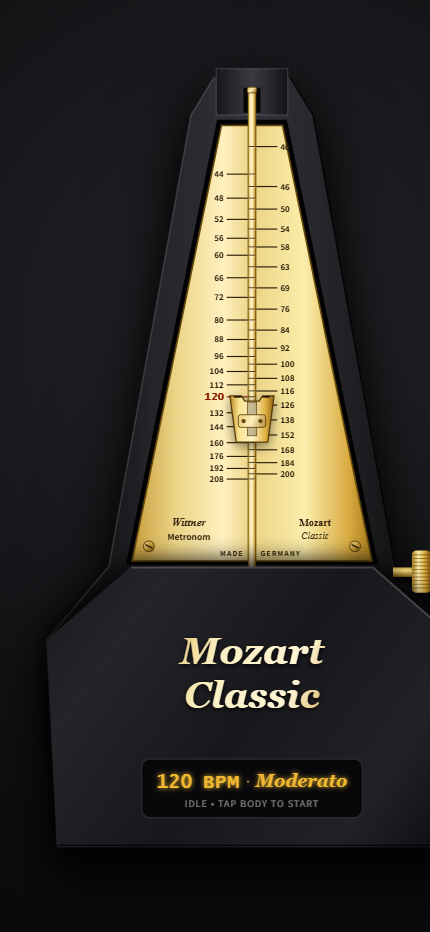

# Wittner Mozart Classic Metronome

A mobile-first, installable Progressive Web App (PWA) that authentically replicates the iconic **Wittner Mozart Classic** wind-up mechanical metronome.



## Features

- **HiDPI Retina Canvas Rendering**: Dynamically scales the canvas drawing buffer with `window.devicePixelRatio` for razor-sharp rendering on modern smartphones and tablets.
- **Physical Inverted Pendulum Motion**: Harmonic motion $\theta(t) = \theta_{max} \cdot \sin(\pi \cdot \frac{\text{BPM}}{60} \cdot t)$ phase-locked to Web Audio time.
- **Authentic Brushed Gold Pendulum Bar**: Flat brass bar with stamped horizontal graduation notch lines at all 38 tempo notches.
- **Non-Linear Tempo Dragging**: Vertical touch/mouse drag on the brass scale or sliding weight snaps cleanly to authentic metronome markings [40 ... 208 BPM]. Tempo adjustment is safely locked while swinging.
- **Synthesized Mechanical Wood Click**: Dual-accent mechanical escapement click ("tick" vs "tock" on alternating beats) synthesized in real-time via Web Audio API with zero desync or frame throttling drift.
- **Discreet Digital Readout**: Inset display shows current BPM and Italian classical musical tempo marking (Larghissimo, Grave, Largo, Lento, Adagio, Andante, Andantino, Andante moderato, Moderato, Allegretto, Allegro, Vivace, Presto, Prestissimo).
- **Offline PWA Support**: Installable on iOS Safari and Android Chrome with complete offline functionality powered by Service Worker.

## Getting Started Locally

```bash
# Install dependencies
npm install

# Start local server
npm start
```

Open [http://localhost:3000](http://localhost:3000) in your mobile or desktop browser.

## Project Structure

```text
├── public/
│   ├── app.js          # Core audio synthesis, canvas renderer & physics
│   ├── index.html      # Responsive mobile HTML shell
│   ├── style.css       # Mobile viewport styling
│   ├── manifest.json   # PWA manifest
│   ├── sw.js           # Offline service worker
│   ├── icon.svg        # Scalable metronome icon
│   ├── icon-192.png    # PWA icon 192x192
│   └── icon-512.png    # PWA icon 512x512
├── server.js           # Minimal Express static file server
├── vercel.json         # Vercel deployment configuration
├── package.json        # Dependencies and scripts
└── README.md
```

## License

MIT
